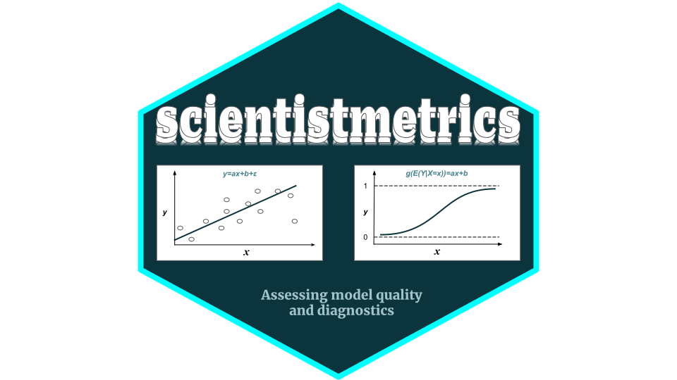

<p align="center">
    </img>
</p>

<div align="center">

[](https://github.com/enfantbenidedieu/scientistmetrics/blob/master/LICENSE)
[](https://pypi.org/project/scientistmetrics/)
[](https://pepy.tech/project/scientistmetrics)
[](https://pepy.tech/project/scientistmetrics)
[](https://pepy.tech/project/scientistmetrics)

</div>

# scientistmetrics : Assessing model quality and diagnostics

scientistmetrics is a Python package for metrics and scoring : quantifying the quality of predictions

## Why scientistmetrics?

scientistmetrics provides multiples functions for :

1. **Residuals :**
    * Estimation residuals
    * Standardized residuals
    * Studentized residuals

2. **Normaliry tests :**
    * Shapiro - Wilk
    * Jarque - Bera
    * Agostino
    * Kolmogorov - Smirnov

3. **Autocorrelation tests :**
    * Durbin - Watson test
    * Breusch - Godfrey test
    * Newey - West HAC test
    * Feasible GLS - Cochrane - Orcutt test
    - Ljung - Box test

4. **Heteroscedasticity tests :**
    * Breusch - Pagan test
    * White test
    * Goldfeld - Quandt test

5. **Others tests :**
    * Likelihood ratio test
    * Hosmer - Lemeshow test
    * Mann - Whitney test
    * Bartlett sphericity test
    * Overdispersion test (for poisson regression model)

6. **Metrics of performance :**
    * For **classification** : accuracy, average precision score, balanced accuracy score, F1 score, precision, recall,, auc, ROC Curve, etc...
    * For **regression** : R2 score,  (root) mean square error, mean absolute error, median absolute error, etc...

7. **Others** : 
    * Model comparison
    * Combination analysis (from model with $1$ variable to model with $p$ variables)
    * Association between qualitatives variables : Chi2, Cramer's V, Tschuprow's T

Notebook is availabled.

## Installation

### Dependencies

scientistmetrics requires :

```python
python >=3.10
numpy >=1.26.4
pandas >=2.2.2
scikit-learn >=1.2.2
plotnine >=0.10.1
statsmodels >=0.14.0
scipy >=1.10.1
```

## User installation

You can install scientistmetrics using pip :

```python
pip install scientistmetrics
```


## Author(s)

Duvérier DJIFACK ZEBAZE [duverierdjifack@gmail.com](mailto:duverierdjifack@gmail.com)